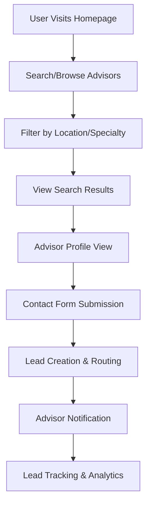
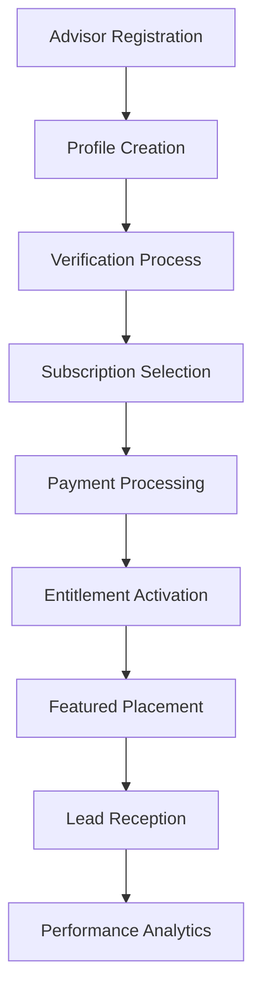
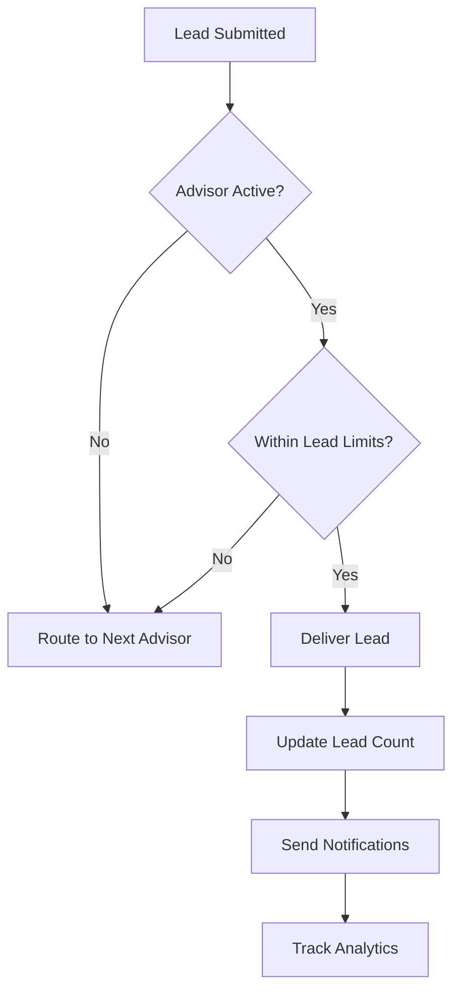

# Hockey Directory - System Architecture

**Version:** 1.0  
**Date:** September 2025

---

## 🏗️ System Overview

The Hockey Directory is a full-stack web application built with modern technologies to create a scalable, secure, and performant platform for connecting hockey families with verified service providers.

### Core Architecture Principles

- **Type Safety**: End-to-end TypeScript with strict configuration
- **Security First**: Input validation, rate limiting, and PII protection
- **Performance**: Sub-2.5s load times with optimized database queries
- **Scalability**: Designed for 40k+ monthly active users
- **Maintainability**: Clean architecture with separated concerns

---

## 🎯 High-Level Architecture

```
┌─────────────────────────────────────────────────────────────────┐
│                          CLIENT LAYER                           │
├─────────────────────────────────────────────────────────────────┤
│  Next.js 14 App Router  │  React Server Components  │  Tailwind  │
│  shadcn/ui Components   │  TanStack Query           │  TypeScript │
└─────────────────────────────────────────────────────────────────┘
                                    │
                                    ▼
┌─────────────────────────────────────────────────────────────────┐
│                        API LAYER                                │
├─────────────────────────────────────────────────────────────────┤
│  Next.js API Routes     │  Zod Validation           │  Rate Limit │
│  Authentication         │  Error Handling           │  Logging    │
└─────────────────────────────────────────────────────────────────┘
                                    │
                                    ▼
┌─────────────────────────────────────────────────────────────────┐
│                      BUSINESS LOGIC                             │
├─────────────────────────────────────────────────────────────────┤
│  Subscription Logic     │  Lead Routing             │  Rankings   │
│  Commission Tracking    │  Moderation Queue         │  Analytics  │
└─────────────────────────────────────────────────────────────────┘
                                    │
                                    ▼
┌─────────────────────────────────────────────────────────────────┐
│                        DATA LAYER                               │
├─────────────────────────────────────────────────────────────────┤
│  Prisma ORM            │  SQLite (Dev)             │  PostgreSQL │
│  Migration System      │  Connection Pooling       │  (Production)│
└─────────────────────────────────────────────────────────────────┘
                                    │
                                    ▼
┌─────────────────────────────────────────────────────────────────┐
│                     EXTERNAL SERVICES                           │
├─────────────────────────────────────────────────────────────────┤
│  Stripe Payments       │  PostHog Analytics        │  Sentry     │
│  Turnstile CAPTCHA     │  Email Service            │  Monitoring │
└─────────────────────────────────────────────────────────────────┘
```

---

## 📊 Data Flow Architecture

### 1. User Discovery Flow



### 2. Advisor Management Flow



### 3. Business Logic Flow



---

## 🗄️ Database Architecture

### Entity Relationship Diagram

```
┌─────────────┐    ┌─────────────┐    ┌─────────────┐
│   USERS     │    │   ADVISORS  │    │    LEADS    │
├─────────────┤    ├─────────────┤    ├─────────────┤
│ id (PK)     │    │ id (PK)     │    │ id (PK)     │
│ email       │    │ slug        │    │ advisor_id  │
│ role        │    │ name        │    │ parent_email│
│ advisor_id  │    │ verified    │    │ message     │
└─────────────┘    │ completeness│    │ status      │
                   └─────────────┘    └─────────────┘
                           │                  │
                           ▼                  ▼
               ┌─────────────────┐    ┌─────────────┐
               │  ENTITLEMENTS   │    │   REVIEWS   │
               ├─────────────────┤    ├─────────────┤
               │ id (PK)         │    │ id (PK)     │
               │ advisor_id (FK) │    │ advisor_id  │
               │ plan_id (FK)    │    │ rating      │
               │ active          │    │ status      │
               │ renews_at       │    │ body        │
               └─────────────────┘    └─────────────┘
```

### Database Scaling Strategy

#### Development (SQLite)
- Single file database for rapid development
- Automatic migrations with Prisma
- Seed data for consistent testing environment

#### Production (PostgreSQL)
- Connection pooling for concurrent users
- Read replicas for performance optimization
- Automated backups with point-in-time recovery
- Database monitoring and query optimization

---

## 🔐 Security Architecture

### Authentication & Authorization

```
┌─────────────────────────────────────────────────────────────┐
│                    SECURITY LAYERS                          │
├─────────────────────────────────────────────────────────────┤
│  Input Validation (Zod)     │  Rate Limiting (IP + User)   │
│  CAPTCHA Verification       │  SQL Injection Prevention    │
│  XSS Protection            │  CSRF Token Validation       │
│  PII Encryption            │  Secure Session Management   │
└─────────────────────────────────────────────────────────────┘
```

### Data Protection Strategy

1. **Input Sanitization**: All user inputs validated with Zod schemas
2. **Rate Limiting**: IP and user-based limits to prevent abuse
3. **PII Protection**: Email/phone encryption at rest
4. **Access Control**: Role-based permissions (admin, advisor, parent)
5. **Audit Trail**: All sensitive actions logged with correlation IDs

---

## ⚡ Performance Architecture

### Optimization Strategies

#### Frontend Performance
```typescript
// Performance budgets
const PERFORMANCE_BUDGETS = {
  LCP: '2.5s',           // Largest Contentful Paint
  FID: '100ms',          // First Input Delay  
  CLS: '0.1',            // Cumulative Layout Shift
  bundleSize: '200kb'    // JavaScript bundle size
}
```

#### Backend Performance
```typescript
// Database optimization
- Query optimization with proper indexing
- Connection pooling for concurrent requests
- Caching strategy for frequently accessed data
- Background job processing for heavy operations
```

#### Caching Strategy
```
┌─────────────────────────────────────────────────────────────┐
│                     CACHING LAYERS                          │
├─────────────────────────────────────────────────────────────┤
│  Browser Cache      │  CDN (Static Assets)   │  Edge Cache  │
│  React Query        │  Server-side Cache     │  DB Query    │
│  (Client State)     │  (API Responses)       │  Results     │
└─────────────────────────────────────────────────────────────┘
```

---

## 📈 Analytics & Monitoring Architecture

### Event Tracking System

```typescript
// Analytics pipeline
User Action → PostHog Event → Data Processing → Business Intelligence

// Key metrics tracked:
- User engagement (page views, session duration)
- Conversion funnel (search → profile → lead)
- Business metrics (subscriptions, lead conversion)
- Performance metrics (load times, error rates)
```

### Monitoring Stack

```
┌─────────────────────────────────────────────────────────────┐
│                   MONITORING STACK                          │
├─────────────────────────────────────────────────────────────┤
│  Application       │  Performance         │  Business       │
│  - Sentry (Errors) │  - Core Web Vitals  │  - Revenue      │
│  - Uptime          │  - API Response      │  - Conversions  │
│  - Logs            │  - DB Queries       │  - User Growth  │
└─────────────────────────────────────────────────────────────┘
```

---

## 🚀 Deployment Architecture

### Environment Strategy

#### Development
```yaml
Environment: Local
Database: SQLite file
Authentication: Mock/bypass
External Services: Test/sandbox APIs
Monitoring: Console logging only
```

#### Staging
```yaml
Environment: Vercel Preview
Database: PostgreSQL (staging instance)  
Authentication: Full implementation
External Services: Test/sandbox APIs
Monitoring: Full stack with test data
```

#### Production
```yaml
Environment: Vercel Production
Database: PostgreSQL (production cluster)
Authentication: Full implementation
External Services: Production APIs
Monitoring: Full observability stack
```

### CI/CD Pipeline

```
Developer → Git Push → GitHub Actions → Tests → Build → Deploy
                            │
                            ▼
                    ┌─────────────────┐
                    │  Quality Gates  │
                    ├─────────────────┤
                    │ TypeScript      │
                    │ Linting         │
                    │ Unit Tests      │
                    │ Integration     │
                    │ Security Scan   │
                    └─────────────────┘
```

---

## 🔧 Service Integration Architecture

### External Service Dependencies

#### Payment Processing (Stripe)
```typescript
// Integration pattern
User Purchase → Stripe Checkout → Webhook → Entitlement Update
                                     │
                                     ▼
                              Database Transaction
```

#### Analytics (PostHog)
```typescript
// Event tracking pattern  
User Action → Client Event → PostHog API → Analytics Dashboard
                  │
                  ▼
            Local Event Store
```

#### Security (Turnstile)
```typescript
// CAPTCHA verification pattern
Form Submit → Turnstile Token → Server Verification → Action Allowed
```

---

## 🔄 Scalability Considerations

### Horizontal Scaling Strategy

#### Current Architecture (0-10k users)
- Single Next.js instance
- SQLite/PostgreSQL single instance
- Direct API calls to external services

#### Growth Phase (10k-50k users)
- Multiple Next.js instances with load balancing
- PostgreSQL with read replicas
- Redis caching layer
- Background job processing

#### Scale Phase (50k+ users)
- Auto-scaling Next.js instances
- Database sharding by geographic region
- Microservices for heavy operations
- CDN for global content delivery

---

## 📝 Development Workflow

### Code Organization

```
src/
├── app/                    # Next.js App Router pages
├── components/             # Reusable UI components
├── lib/
│   ├── business/          # Business logic functions
│   ├── database/          # Database utilities
│   ├── security/          # Security utilities
│   └── analytics/         # Analytics helpers
├── config/                # Configuration files
├── types/                 # TypeScript type definitions
└── utils/                 # General utilities
```

### Architecture Decision Records (ADRs)

Major architectural decisions are documented in:
- `/docs/adr/001-database-choice.md`
- `/docs/adr/002-authentication-strategy.md`
- `/docs/adr/003-state-management.md`

---

*This architecture supports The Hockey Directory's goal of becoming a scalable, secure, and high-performance platform for the hockey community while maintaining development velocity and code quality.*